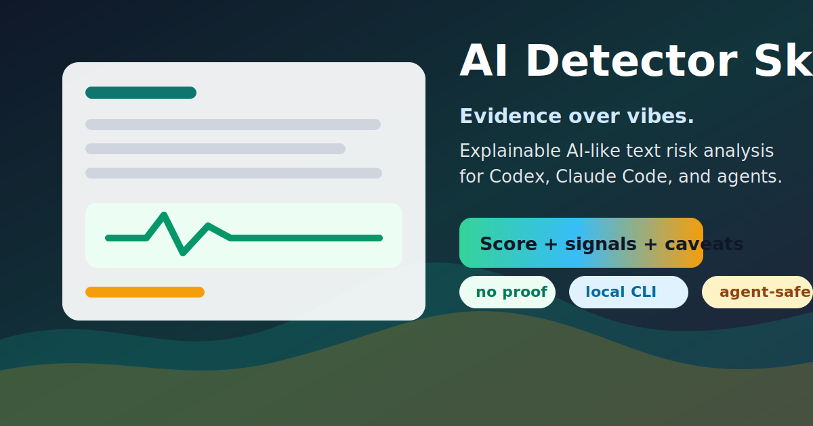
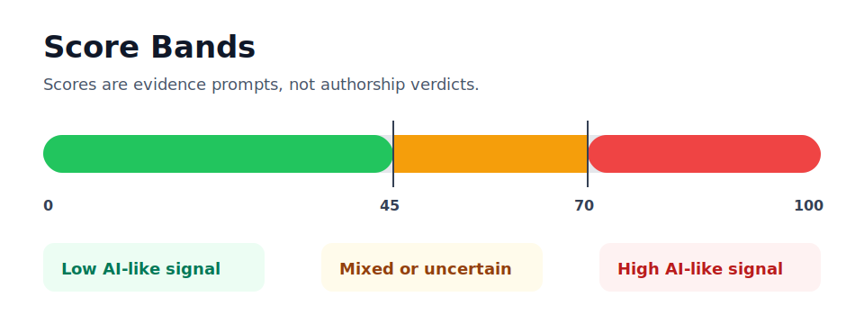
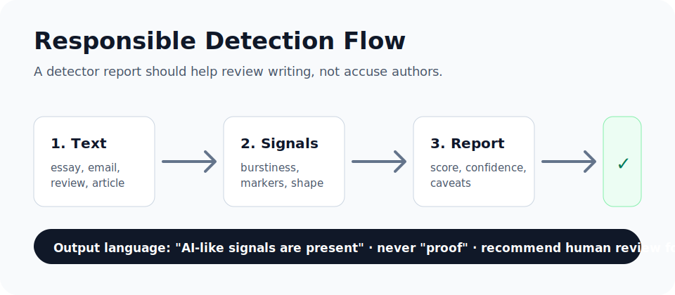

# AI Detector Skill




A compact, honest, agent-friendly **AI-generated text risk analyzer** for Codex, Claude Code, Cursor, Aider, Continue, and other repo-aware agents.

The project is deliberately modest: **do not claim proof**. It returns a score, confidence, evidence signals, caveats, and next steps so an agent can talk about AI-like writing responsibly.

## Highlights

- Explainable weighted signals, not a black-box accusation machine.
- Local CLI and Python API with zero runtime network calls.
- Short-text guardrail: samples under about 80 words return `insufficient_text`.
- Agent-ready instructions in `AGENTS.md`, `.claude/skills/ai-detector/SKILL.md`, and `docs/AGENT_PROMPT.md`.
- Repeatable synthetic benchmark report in `docs/BENCHMARK.md`.

## Install

```bash
pip install -e .
```

## Use as CLI

```bash
ai-detect examples/sample_ai_like.txt
cat essay.txt | ai-detect --json
```

Example output:

```text
Conclusion: AI-like signals are present, but this medium-confidence score is a risk estimate rather than proof.
Score: 84/100
Confidence: medium
Verdict: high_ai_likelihood
Words analyzed: 256
```

## Use as Python Library

```python
from aidetect import analyze_text

result = analyze_text(open("essay.txt", encoding="utf-8").read())
print(result.score, result.confidence, result.verdict)
for signal in result.strongest_signals():
    print(signal.name, signal.note)
```

## Use as an Agent Skill

### Claude Code

Copy `.claude/skills/ai-detector/` into your Claude Code skills location, or keep it in this repo and ask Claude Code to use the `ai-detector` skill.

### Codex and Other Repo-Aware Agents

Keep `AGENTS.md` at the repository root. Agents that read repo instructions will learn when and how to call the analyzer.

### Generic Agent Prompt

Use `docs/AGENT_PROMPT.md` as a portable instruction block.

## Output Contract

The analyzer returns:

- `score`: 0-100 AI-like writing risk estimate
- `verdict`: `insufficient_text`, `low_ai_likelihood`, `mixed_or_uncertain`, or `high_ai_likelihood`
- `confidence`: `low` or `medium`
- `word_count`: analyzed token count
- `conclusion`: one-sentence uncertain summary
- `signals`: weighted evidence, not accusations
- `caveats`: safety notes for responsible use
- `next_steps`: useful follow-up actions



## Responsible Workflow



1. Run the analyzer on a sufficiently long sample.
2. Read the strongest evidence signals in context.
3. Keep caveats attached to the score.
4. For high-stakes contexts, require human review and comparison with known writing samples.

Preferred wording:

- "AI-like signals are present."
- "The result is uncertain because the sample is short."
- "This should be reviewed against known writing samples."

Avoid:

- "This was written by AI."
- "The detector proves misconduct."
- Accusations against a named person.

## Benchmark

Run:

```bash
make benchmark
```

Current synthetic sanity-check:

- AI-like mean score: `84.0`
- Human-like mean score: `35.0`
- Synthetic separation: `49.0` points
- Short sample verdict: `insufficient_text`

See the full report in [`docs/BENCHMARK.md`](docs/BENCHMARK.md).

## Development

```bash
make test
make demo
make benchmark
```

## Design Principles

1. Evidence over vibes.
2. Never accuse a person.
3. Prefer uncertainty to false confidence.
4. No network calls and no heavyweight model dependency by default.
5. Make it easy for agents to inspect and adapt.

## License

MIT
